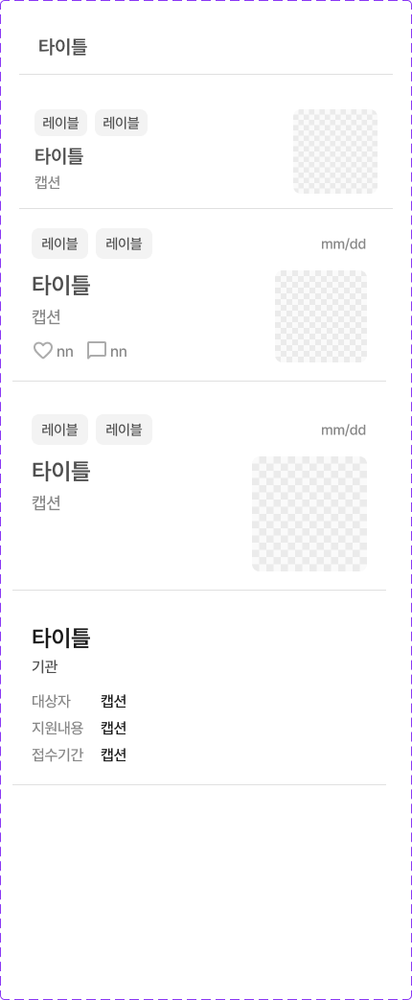

# Figma Recapture: AppListItem / Medium

- Recaptured at: `2026-07-12 KST`
- Cursor MCP channel: `chamchamcham`
- Figma file key: `44I8cu41vwv7JViVr8McUs`
- Design-system component set: `list` (`341:2440`)
- Medium component: `size=medium` (`341:2441`)
- Community screen: `커뮤니티 메인 / default` (`631:7665`)
- Community list container: `content-list` (`631:7667`)
- Evidence: TalkToFigma `get_selection`, `get_node_info`,
  `get_nodes_info`, `scan_nodes_by_types`, and `export_node_as_image`
- Saved export: [AppListItem component set](assets/2026-07-12-app-list-item-component-set.png)
- Export size: `430 × 1043`
- PNG SHA-256: `90a1a7aa4acb57a8ea107ef4257b42c395b78a372078e8c9330cf245a22208b2`



## Confirmed Medium Row Geometry

All values below were read from Figma node bounds. They are not visual
estimates.

| Element | Relative bounds | Notes |
|---|---:|---|
| Row | `x 0, y 0, 390 × 160` | `size=medium` |
| Header | `x 20, y 0, 350 × 32` | badge and date |
| Content | `x 20, y 44, 350 × 96` | 12pt below header |
| Text column | `x 0, y 0, 242 × 96` | relative to content |
| Thumbnail | `x 254, y 0, 96 × 96` | 12pt after text; radius 8 |
| Title | `x 0, y 0, 242 × 31` | Pretendard SemiBold 24, line height 31.2 |
| Caption | `x 0, y 35, 242 × 27` | 4pt below title |
| Reaction row | `x 0, y 72, 100 × 24` | 10pt below caption |

The content ends at row-relative `y=140`. The row ends at `y=160`, so the
confirmed space from content bottom to the row's bottom divider is `20pt`.

## Divider and Inter-row Spacing

The community screen contains repeated medium instances at these list-relative
positions:

| Instance | Y | Height | Bottom |
|---|---:|---:|---:|
| `851:10172` | 0 | 160 | 160 |
| `851:10247` | 180 | 160 | 340 |
| `851:10197` | 360 | 160 | 520 |
| `851:10222` | 540 | 160 | 700 |
| `631:7668` | 720 | 160 | 880 |

Therefore the Figma `content-list` uses a confirmed `20pt` gap between each
`160pt` row. Because the divider belongs to the row's bottom stroke, the visual
vertical rhythm is:

```text
96pt content
20pt empty space
bottom divider
20pt inter-row space
next row header
```

The row stroke color returned by TalkToFigma is `#E0E0E0`. The local
TalkToFigma read API did not expose stroke side, weight, or alignment. A second
programmatic read through the hosted Figma MCP was attempted, but the connected
View seat had reached its MCP call limit. Those properties are therefore not
newly asserted in this recapture.

The exported Figma PNG confirms that both reaction icons use `#ACACAC`, which
maps to `Color.Icon.disabled`:

| Icon crop | Exact `#ACACAC` pixels | Exact `#686868` pixels |
|---|---:|---:|
| favorite | 52 | 0 |
| chat bubble | 123 | 0 |

`#686868` is `Color.Icon.subtle`; it does not occur in either icon crop. The
existing `Color.Icon.disabled` change in `AppListItem` is therefore intentional
and matches the recaptured Figma source.

## Code Comparison

- Existing `AppListItem(size: .medium)` already matches the confirmed internal
  geometry: 390×160 canvas, 20pt horizontal inset, 32pt header, 12pt header gap,
  96pt content, 242pt text column, 12pt media gap, and 96pt thumbnail.
- At recapture time, `CommunityView` rendered a separate `CommunityPostRow`
  instead of reusing `AppListItem`.
- Its then-current `LazyVStack(spacing: 0)` did not match the captured `20pt`
  inter-row spacing. This was the confirmed cause of the divider-to-next-row
  spacing mismatch.
- No design-system source change is authorized or implied by this document.

## Unconfirmed

- Exact vector paths and variable-binding metadata inside the nested
  favorite/chat instances are not exposed by the local TalkToFigma node read.
  Their rendered tint is confirmed as `#ACACAC` by the exported PNG.
- Exact bottom-stroke weight/alignment could not be independently retrieved in
  this recapture because of the hosted Figma MCP rate limit noted above.
