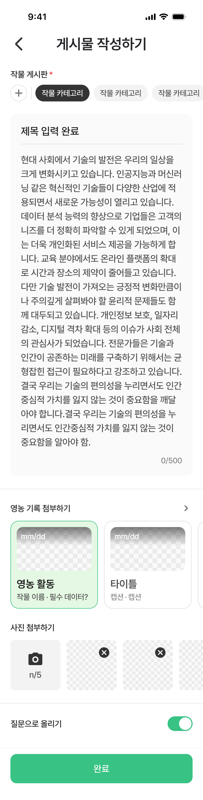

# Figma Recapture: 게시물 작성 / 전체값 입력 완료

- Requested state label: `게시물 작성 / 필수+전체값 입력 완료`
- Recaptured at: `2026-07-12 KST`
- Cursor MCP channel: `chamchamcham`
- Source: TalkToFigma MCP `get_selection`, `get_node_info`,
  `export_node_as_image`
- Figma page: `UI 최종` (`226:2699`)
- Figma node: `631:7861`
- Figma frame name: `게시물 작성 / 전체값 입력 완료`
- Frame size: `390 × 1530`
- Export: [2x PNG](assets/2026-07-12-community-compose-all-complete.png),
  `780 × 3060`
- PNG SHA-256:
  `ef50a81969677ddbe0a224aef5ba40dc16f60327e8ff7483cc678d052496d93d`
- Capture state: 필수값 입력에 더해 첫 영농기록 선택, 사진 3개 첨부,
  질문 토글 on, 완료 버튼 활성

## Difference From Required Complete

The frame dimensions and section positions are unchanged from the required-only
state (`631:7819`). The changes are optional-value component states.

| Property | Required complete | All complete (`631:7861`) |
|---|---|---|
| Crop/title/body | filled | unchanged |
| First farming-record card | unselected | selected |
| Image attachments | none | three visible attachments |
| Image counter | `0/5` | `n/5` placeholder |
| Question toggle | off | on |
| Submit button | enabled | enabled |

## Confirmed Selected Farming-Record Card

- Component instance: `631:7888`.
- Size: `168 × 168`.
- Fill: `#E4F8E3`.
- Stroke: `#38C284`.
- Corner radius: 16.
- Title color changes from the unselected `#4F4F4F` to `#1A1A1A`.
- Caption color changes from the unselected `#878787` to `#4F4F4F`.
- Typography and internal geometry do not change.

This is a state of the existing Figma card component. It must map to the
selected state of the code design-system card rather than a feature-local card.

## Confirmed Image Attachment State

- Empty uploader instance: `631:7894`, `96 × 96`, fill `#F3F3F3`.
- Attached-image instances: `631:7895`, `631:7896`, `631:7897`.
- Each attached image is `96 × 96`, radius 8, with a `24 × 24` cancel icon.
- Horizontal item gap: 12pt (`x = 20, 128, 236, 344`).
- The fourth item extends beyond the 390pt frame, confirming horizontal
  scrolling rather than wrapping.

## Confirmed Question Toggle State

- Component instance: `631:7901`.
- Track: `48 × 28`, fill `#38C284`.
- Thumb: `24 × 24`, white, inset 2, aligned trailing.
- The label styling and row geometry are unchanged from the off state.

This must reuse the existing `AppToggle` state. Do not recreate the track or
thumb inside `CommunityComposeView`.

## Confirmed Figma Placeholders / Inconsistencies

Two visible counters do not reflect the content rendered in this frame:

1. The body contains exactly 500 characters, while the counter remains
   `0/500`.
2. Three image attachments are visible, while the uploader counter reads
   `n/5`, not `3/5`.

These are recorded as Figma placeholder inconsistencies, not production
behavior. Runtime counters should be derived from actual body and attachment
state unless a later captured frame provides different confirmed behavior.

## Implementation Guardrails

- Do not implement yet; capture the two validation states first.
- Reuse `AppCard` for the farming-record card and its selected state.
- Reuse `AppImageUploadSlot` for both the uploader and removable images.
- Reuse `AppToggle`; the captured on state matches its 48 × 28 component
  geometry.
- Preserve horizontal scrolling for both farming records and image attachments.
- Do not implement the status bar template.
