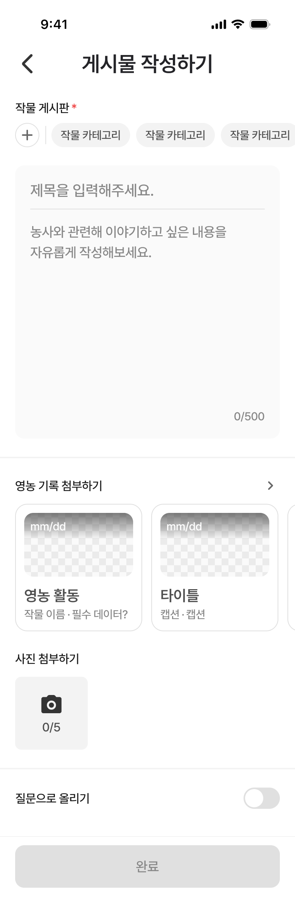

# Figma Recapture: 게시물 작성 / default

- Recaptured at: `2026-07-12 KST`
- Cursor MCP channel: `chamchamcham`
- Source: TalkToFigma MCP `get_selection`, `read_my_design`,
  `scan_text_nodes`, `get_node_info`, `get_document_info`,
  `export_node_as_image`
- Figma page: `UI 최종` (`226:2699`)
- Figma node: `631:7777`
- Frame name: `게시물 작성 / default`
- Frame size: `390 × 1202`
- Export: [2x PNG](assets/2026-07-12-community-compose-default.png),
  `780 × 2404`
- PNG SHA-256:
  `06d7b076d303ace8c764456a7cb2c4d558a69ea67d05edef32c42452a285e481`
- Capture state: 작물 게시판, 제목, 내용, 사진이 선택·입력되지 않았고
  질문 토글과 완료 버튼이 비활성인 초기 상태

## Requested State Set

| State | Status | Captured node |
|---|---|---|
| 게시물 작성 / default | captured | `631:7777` |
| 게시물 작성 / 필수값 입력 완료 | captured | `631:7819` |
| 게시물 작성 / 필수+전체값 입력 완료 | captured | `631:7861` |
| 게시물 작성 / 제목 글자수 초과 | captured | `631:9778` |
| 게시물 작성 / 내용 글자수 초과 | user-confirmed delta; capture skipped | title-over-limit reference |

동일하거나 유사한 프레임 이름이 Figma 페이지에 여러 개 있으므로, pending
상태의 node id는 이름만 보고 추정하지 않고 사용자가 선택한 노드로 확정한다.
제목 초과 상태도 프레임 이름은 `필수값 입력 완료`로 남아 있었으며, 선택된
노드의 실제 오류 텍스트와 렌더링을 통해 상태를 확정했다.
내용 초과 상태는 사용자 지시에 따라 별도 캡처하지 않았으며, 제목 초과
상태에서 안내 문구만 `내용은 최대 500자까지 입력 가능합니다.`로 바뀌는
스펙으로 기록했다.

## Confirmed Screen Structure

좌표는 프레임 상단을 `y = 0`으로 환산한 값이다.

| Area | Relative bounds | Notes |
|---|---:|---|
| Status bar template | `0…54` | 기기 chrome; 앱에서 중복 구현하지 않음 |
| `top-app-bar` | `54…114`, `390 × 60` | detail 타입 인스턴스 |
| Crop label header | `130…154`, `390 × 24` | leading inset 20 |
| Crop chip list | `154…202`, `390 × 48` | fixed add area + horizontal list |
| Text area | `218…578`, `350 × 360` | x inset 20, radius 12 |
| First divider | `602…604`, `390 × 2` | component instance |
| Farming-record uploader | `628…832`, `390 × 204` | horizontal `168 × 168` cards |
| Image uploader | `856…988`, `390 × 132` | first slot `96 × 96` |
| Second divider | `1012…1014`, `390 × 2` | component instance |
| Question toggle row | `1038…1066`, `390 × 28` | toggle `48 × 28` |
| Bottom button area | `1102…1202`, `390 × 100` | button `350 × 56` |

Confirmed gaps include 16pt between the top app bar and crop header, 16pt
between the chip row and text area, and 24pt around the major content sections.

## Confirmed Component Instances

The following names and types were returned by Cursor MCP. They must be mapped
against the existing code design system before any feature-local replacement is
written.

| Figma node | Type | Captured state |
|---|---|---|
| `top-app-bar` (`631:7815`) | instance | detail, centered title, leading back icon |
| `chip` (`631:7786` etc.) | instance | unselected muted crop chips |
| `card` (`631:7804` etc.) | instance | `168 × 168`, unselected |
| `image-uploader` (`631:7810`) | instance | empty, `0/5` |
| `divider` (`833:9101`, `833:9098`) | instance | `390 × 2` |
| `toggle` (`631:7814`) | instance | off |
| `button` (`631:7818`) | instance | disabled |

## Confirmed Text Styles

| Area | Text | Typography | Color |
|---|---|---|---|
| Top app bar | `게시물 작성하기` | Pretendard SemiBold 28, LH 36.4, tracking -0.28 | `#242428` |
| Crop label | `작물 게시판` | Pretendard Medium 16, LH 24, tracking -0.32 | `#1A1A1A` |
| Required marker | `*` | Pretendard Medium 16, LH 24, tracking -0.32 | `#EF4444` |
| Crop chip | `작물 카테고리` | Pretendard Medium 15, LH 19.5, tracking -0.3 | `#4F4F4F` |
| Title placeholder | `제목을 입력해주세요.` | Pretendard Medium 20, LH 26, tracking -0.2 | `#878787` |
| Body placeholder | two visible lines | Pretendard Medium 18, LH 27, tracking -0.36 | `#878787` |
| Counter | `0/500` | Pretendard Medium 15, LH 19.5, tracking -0.3 | `#878787` |
| Section labels | 영농 기록/사진/질문 | Pretendard Medium 16, LH 24, tracking -0.32 | `#1A1A1A` |
| Card title | `영농 활동`, `타이틀` | Pretendard SemiBold 20, LH 26, tracking -0.2 | `#4F4F4F` |
| Card captions/date | caption, `mm/dd` | Pretendard Medium 15, LH 19.5, tracking -0.3 | muted / inverse |
| Image count | `0/5` | Pretendard Medium 16, LH 24, tracking -0.32 | `#4F4F4F` |
| Disabled submit | `완료` | Pretendard Medium 18, LH 27, tracking -0.36 | `#878787` |

The body placeholder text node has a `310 × 235` bounding box even though the
export visibly renders two lines. Do not infer a 235pt text height or additional
lines from that node alone; the containing body area is `310 × 266`.

## Confirmed Visual Values

- Screen/background: `#FFFFFF`.
- Text-area fill: `#FAFAFA`; corner radius 12.
- Muted chips and image uploader: `#F3F3F3`.
- Borders: `#E0E0E0`.
- Section dividers: `#F3F3F3`, height 2.
- Text-area horizontal inset: 20; internal horizontal inset: 20.
- Farming-record card: `168 × 168`, inset 12, radius 16.
- Farming-record image: `144 × 84`, radius 12.
- Image uploader: `96 × 96`, radius 8.
- Toggle: `48 × 28`, off fill `#E0E0E0`, thumb `24 × 24` white.
- Disabled submit: `350 × 56`, fill `#E0E0E0`, radius 12.

## Recapture Correction

The older 2026-07-08 document recorded the empty image counter as `0/10`.
Cursor MCP and the new 2x export both confirm that the current Figma frame shows
`0/5`. The 2026-07-12 recapture is authoritative for this implementation pass.

## Implementation Guardrails

- Capture all five requested states before modifying `CommunityComposeView`.
- Reuse code design-system components corresponding to the confirmed Figma
  instances. Do not recreate cards, toggle, dividers, uploader, chips, top bar,
  or submit button in the feature screen.
- Do not implement the status bar template.
- The 1202pt design frame represents scrollable content plus a fixed/safe-area
  bottom action. Do not use a fixed-height full-screen SwiftUI layout.
- No code implementation was performed during this capture.
