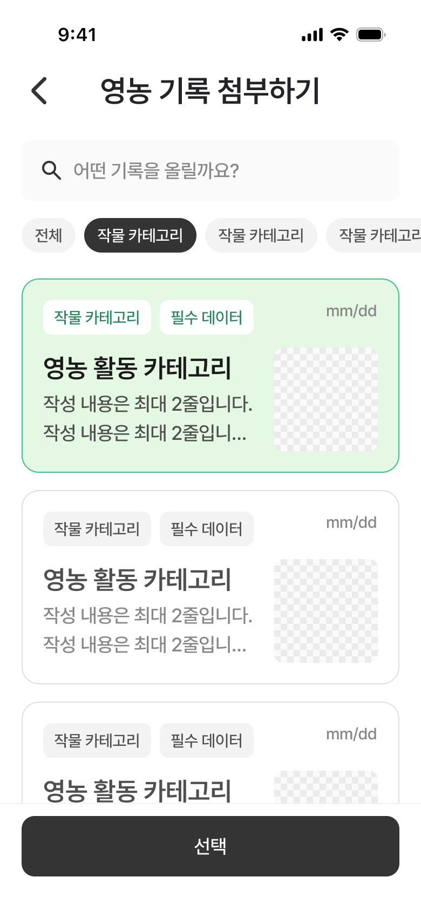

# Figma Recapture: 게시물 작성 / 영농 기록 첨부 더보기 탭 - 영농 기록 선택

- Recaptured at: `2026-07-12 KST`
- Cursor MCP channel: `chamchamcham`
- Source: TalkToFigma MCP `get_selection`, `get_node_info`,
  `get_nodes_info`, `export_node_as_image`
- Figma page: `UI 최종` (`226:2699`)
- Figma node: `631:9420`
- Frame name: `게시물 작성 / 영농 기록 첨부 더보기 탭 - 영농 기록 선택`
- Frame size: `390 × 844`
- Export: [2x PNG](assets/2026-07-12-community-compose-record-picker-selected.png),
  `780 × 1688`
- PNG SHA-256:
  `bb71e76308fc0c85ec2a13137fec9a07e141cd62aedf46d3df8af2fb81d61b4c`
- Capture state: 첫 작물 카테고리 필터 선택, 첫 영농 기록 카드 선택,
  검색어 없음, 하단 선택 버튼 활성

## Confirmed Screen Geometry

Coordinates are relative to the top of the selected frame.

| Area | Relative bounds | Notes |
|---|---:|---|
| Status bar template | `0…54` | device chrome; do not implement |
| `top-app-bar` | `54…114`, `390 × 60` | centered title and leading back icon |
| Search bar | `130…186`, `350 × 56` | horizontal inset 20 |
| Filter area | `186…250`, `370 × 64` | horizontally scrolling chip row |
| Visible chip row | `202…234`, height 32 | gap 8 |
| Record list | starts at `258` | vertical scroll content |
| First card | `258…438`, `350 × 180` | selected |
| Second card | `454…634`, `350 × 180` | unselected |
| Third card | `650…830`, `350 × 180` | partially covered by bottom area |
| Fourth card | `846…1026`, `350 × 180` | below the captured viewport |
| Bottom action area | `744…844`, `390 × 100` | fixed above list content |
| Select button | `756…812`, `350 × 56` | horizontal inset 20 |

The cards use a 16pt vertical gap. The exported frame visibly shows scroll
content behind the fixed bottom action area. Implementation must provide enough
bottom content inset for the final card to scroll fully above the button.

## Confirmed Search And Filter State

- Search bar:
  - `350 × 56`, fill `#FAFAFA`, corner radius 8.
  - Search icon slot: `24 × 24`.
  - Placeholder: `어떤 기록을 올릴까요?`.
  - Placeholder typography: Pretendard Medium 18, line height 27.
  - Placeholder color: `#878787`.
- Filter chips:
  - `전체`: unselected, `50 × 32`, fill `#F3F3F3`, text `#4F4F4F`.
  - First `작물 카테고리`: selected, `104 × 32`, fill `#343434`,
    text `#FFFFFF`.
  - Remaining crop chips: unselected, fill `#F3F3F3`, text `#4F4F4F`.
  - Typography: Pretendard Medium 15, line height 19.5.

## Confirmed Record Card States

All cards are `350 × 180`, corner radius 16, with 20pt internal padding. The
header is `310 × 32`; the lower content row is `310 × 96`, split into a
`202 × 96` text column and `96 × 96` thumbnail with radius 8.

| Property | Selected first card | Unselected cards |
|---|---|---|
| Fill | `#E4F8E3` | `#FFFFFF` |
| Border | `#38C284` | `#E0E0E0` |
| Badge fill | `#FFFFFF` | `#F3F3F3` |
| Badge text | `#27865C` | `#4F4F4F` |
| Title | `#1A1A1A` | `#4F4F4F` |
| Caption | `#4F4F4F` | `#878787` |
| Date | `#878787` | `#878787` |

Card content confirmed from the Figma instances:

- Badges: `작물 카테고리`, `필수 데이터`.
- Date: `mm/dd`.
- Title: `영농 활동 카테고리`, Pretendard SemiBold 24, line height 31.2.
- Caption: `작성 내용은 최대 2줄입니다.`, Pretendard Medium 18, line
  height 27.
- The Figma caption node contains three repeated sample lines but has a 54pt
  rendered box and the screenshot shows two lines with truncation. Treat this
  as a two-line display requirement, not three lines of product copy.

## Confirmed Bottom Action

- Fixed area: `390 × 100`, background `#FFFFFF`, top border `#F3F3F3`.
- Enabled button: `350 × 56`, fill `#343434`, corner radius 12.
- Label: `선택`, Pretendard Medium 18, line height 27, `#FFFFFF`.
- The enabled state corresponds to a non-empty record selection.

## Existing Design-System Mapping

These mappings were checked against the current files under
`Core/DesignSystem`; implementation must reuse or extend them rather than
recreate them in the feature screen.

| Figma element | Existing code mapping |
|---|---|
| `top-app-bar` | `AppTopAppBar` — do not modify during this work |
| `search-bar` | `AppSearchBar` with the confirmed placeholder |
| filter `chip` | `AppChip(style: .solid)` |
| record `card` | `AppCard(size: .small)` |
| card badges | `AppBadge` through `AppCard` |
| enabled `선택` button | `AppButton(variant: .secondary, size: .medium, fullWidth: true)` |
| colors, fonts, spacing | `Color+App.swift`, `Font+App.swift`, `Spacing.swift` |

### Confirmed component gap before implementation

The current `AppCard` API has no selected-state input, although this Figma
component instance has a stable selected variant. Its `.small` caption is also
currently limited to one line, while this capture visibly requires two lines.
When implementation starts, handle these as an extension of `AppCard` after
checking the component's other uses; do not create a feature-local duplicate
card or hardcode raw colors and fonts in the picker.

## Implementation Guardrails

- This is a full-screen picker with a scrollable card list and fixed,
  safe-area-aware bottom action.
- Keep the filter chips horizontally scrollable.
- Preserve single record selection and enable `선택` only when a record is
  selected.
- Use actual record data when available; the captured labels and dates are
  placeholders.
- Do not implement the status bar template.
- No production code was changed during this capture.
