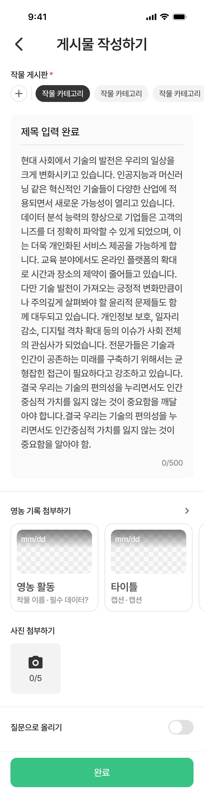

# Figma Recapture: 게시물 작성 / 필수값 입력 완료

- Recaptured at: `2026-07-12 KST`
- Cursor MCP channel: `chamchamcham`
- Source: TalkToFigma MCP `get_selection`, `get_node_info`,
  `scan_text_nodes`, `export_node_as_image`
- Figma page: `UI 최종` (`226:2699`)
- Figma node: `631:7819`
- Frame name: `게시물 작성 / 필수값 입력 완료`
- Frame size: `390 × 1530`
- Export: [2x PNG](assets/2026-07-12-community-compose-required-complete.png),
  `780 × 3060`
- PNG SHA-256:
  `580a7499847f115d433f36c5fa50ae6b9173eab045a22f8e83e4e7fbeb9d72a9`
- Capture state: 첫 작물 게시판 선택, 제목 및 본문 입력 완료, 사진·영농
  기록 미선택, 질문 토글 off, 완료 버튼 활성

## Difference From Default

| Property | Default (`631:7777`) | Required complete (`631:7819`) |
|---|---:|---:|
| Frame height | 1202 | 1530 |
| First crop chip | muted, `#F3F3F3` | selected, `#343434` + white text |
| Title | placeholder | `제목 입력 완료`, 8 characters |
| Body | placeholder | filled, exactly 500 characters |
| Text-area height | 360 | 692 |
| Body-area height | 266 | 598 |
| Image attachments | `0/5` | `0/5` |
| Question toggle | off | off |
| Submit button | disabled `#E0E0E0` | enabled `#38C284` |

The visual changes confirm that crop selection, title, and body are the required
inputs represented by this frame. Farming-record attachment, image attachment,
and the question toggle remain unchanged and are not required for the enabled
submit state shown here.

## Confirmed Expanded Geometry

Coordinates are relative to the top of the selected frame.

| Area | Relative bounds |
|---|---:|
| Status bar template | `0…54` |
| `top-app-bar` | `54…114` |
| Crop label header | `130…154` |
| Crop chip list | `154…202` |
| Text area | `218…910`, `350 × 692` |
| First divider | `934…936`, `390 × 2` |
| Farming-record uploader | `960…1164`, `390 × 204` |
| Image uploader | `1188…1320`, `390 × 132` |
| Second divider | `1344…1346`, `390 × 2` |
| Question toggle row | `1370…1398`, `390 × 28` |
| Bottom button area | `1430…1530`, `390 × 100` |

The text area grows by 332pt from the default frame while the surrounding
section gaps remain unchanged. This is captured evidence that the compose form
must support vertically expanding body content within the scrollable page.

## Confirmed Filled Text Styling

- Selected crop chip:
  - Fill: `#343434`.
  - Text: `#FFFFFF`.
  - Typography remains Pretendard Medium 15, line height 19.5, tracking -0.3.
- Filled title:
  - Text: `제목 입력 완료`.
  - Pretendard Medium 20, line height 26, tracking -0.2.
  - Color: `#1A1A1A`.
- Filled body:
  - Exactly 500 characters in the Figma text node.
  - Pretendard Medium 18, line height 27, tracking -0.36.
  - Color: `#4F4F4F`.
- Enabled submit:
  - Fill: `#38C284`.
  - Label: `#FFFFFF`.
  - Button remains `350 × 56`, corner radius 12.

## Confirmed Figma Inconsistency

The filled body text node contains exactly 500 characters, but the visible
counter text remains `0/500` in both Cursor MCP node data and the exported PNG.
This is not interpreted as product behavior. Do not hardcode `0/500` for filled
content; keep it recorded as a Figma inconsistency until the validation-state
captures establish the intended counter behavior.

## Implementation Guardrails

- Do not implement yet; capture the remaining three requested states first.
- Preserve the confirmed auto-growing text-area behavior rather than fixing the
  screen to the default 360pt height.
- Reuse the existing `AppChip`, `AppCard`, `AppImageUploadSlot`, `AppToggle`,
  `AppDivider`, `AppTopAppBar`, and `AppButton` mappings.
- Do not implement the status bar template.
