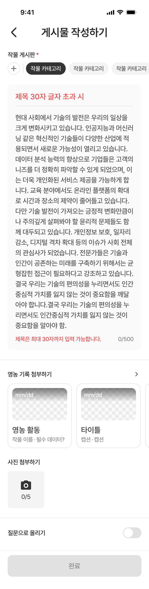

# Figma Recapture: 게시물 작성 / 제목 글자수 초과

- Recaptured at: `2026-07-12 KST`
- Cursor MCP channel: `chamchamcham`
- Source: TalkToFigma MCP `get_selection`, `get_node_info`,
  `get_nodes_info`, `export_node_as_image`
- Figma page: `UI 최종` (`226:2699`)
- Figma node: `631:9778`
- Frame layer name: `게시물 작성 / 필수값 입력 완료`
- Interpreted state: `게시물 작성 / 제목 글자수 초과`, confirmed from the
  rendered error title and validation message rather than the stale frame name
- Frame size: `390 × 1530`
- Export: [2x PNG](assets/2026-07-12-community-compose-title-over-limit.png),
  `780 × 3060`
- PNG SHA-256:
  `afb900e75d013133a31602ffa6a4f8c056434faacc7f243cf13e9a6e08f02f67`
- Capture state: 첫 작물 게시판 선택, 제목 오류, 본문 입력, 사진·영농 기록
  미선택, 질문 토글 off, 완료 버튼 비활성

## Confirmed Validation Presentation

| Element | Confirmed value |
|---|---|
| Title display text | `제목 30자 글자 초과 시` |
| Title typography | Pretendard Medium 20, line height 26 |
| Title color | error `#EF4444` |
| Title divider | neutral `#E0E0E0`; it does not turn red |
| Validation message | `제목은 최대 30자까지 입력 가능합니다.` |
| Validation typography | Pretendard Medium 15, line height 19.5 |
| Validation color | error `#EF4444` |
| Validation position | bottom-left of the body area's description row |
| Body counter | bottom-right, `0/500`, `#878787` |
| Submit button | disabled fill `#E0E0E0`, label `#878787` |

The validation message shares the bottom description row with the body counter.
It is not rendered immediately beneath the title divider. The button becomes
disabled even though the crop and body required values are present, confirming
that a title validation error blocks submission.

## Confirmed Geometry

Coordinates are relative to the top of the selected frame.

| Area | Relative bounds |
|---|---:|
| Status bar template | `0…54` |
| `top-app-bar` | `54…114` |
| Crop label header | `130…154` |
| Crop chip list | `154…202` |
| Text area | `218…910`, `350 × 692` |
| Title row | `238…276`, `310 × 38` |
| Title divider | `276`, width 310 |
| Body content area | `292…890`, `310 × 598` |
| Validation/counter row | `871…890`, `310 × 19` |
| First divider | `934…936`, `390 × 2` |
| Farming-record uploader | `960…1164`, `390 × 204` |
| Image uploader | `1188…1320`, `390 × 132` |
| Second divider | `1344…1346`, `390 × 2` |
| Question toggle row | `1370…1398`, `390 × 28` |
| Bottom button area | `1430…1530`, `390 × 100` |

This frame keeps the same expanded 692pt text-area geometry as the required
complete state. No extra vertical space is inserted for the title error; the
message occupies the existing bottom description row.

## Figma Data Caveats

- The top-level frame layer is still named `게시물 작성 / 필수값 입력 완료`.
  The selected node is identified as the title-over-limit state only because
  its rendered title and validation message explicitly show the title error.
- The displayed title text has 14 Unicode characters, not more than 30. It is a
  state label/example in the mockup, so it must not be treated as a literal test
  value for the character-count algorithm.
- The body text node contains exactly 500 characters, but the visible body
  counter remains `0/500`. As in the required-complete capture, this is recorded
  as a Figma inconsistency and must not be hardcoded as production behavior.

## Implementation Guardrails

- Do not implement yet; capture the remaining body-over-limit state first.
- Use the actual input count for validation and counters; do not copy the
  mockup's placeholder count values into behavior.
- Preserve the neutral title divider while applying the error token to the
  title and helper message.
- Reuse the existing design-system components and tokens for chips, text area,
  cards, image uploader, toggle, dividers, top app bar, and button.
- Do not implement the status bar template.
