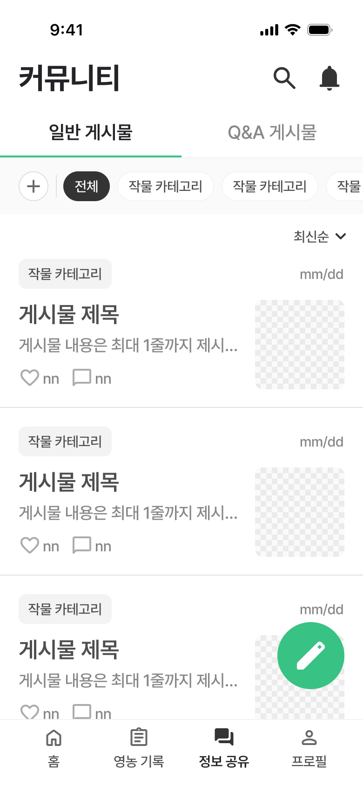
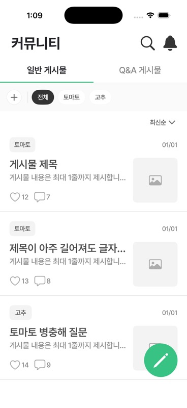

# Figma Capture: Community Main / Default

- Captured at: `2026-07-12 12:20 KST`
- Source: TalkToFigma MCP `join_channel(chamchamcham)`, `get_selection`, `read_my_design`, `scan_text_nodes`, `export_node_as_image`
- Figma page: `UI 최종` (`226:2699`)
- Figma node: `631:7665`
- Frame name: `커뮤니티 메인 / default`
- Frame size: `390 x 844`
- Export: [2x PNG](assets/2026-07-12-community-main-default.png), `780 x 1688`
- PNG SHA-256: `e6bc879d3c123f68f5187836a2ce83be268618070f659f60460760aad75f85dd`
- Capture state: 일반 게시물 탭과 `전체` 작물 칩이 선택된 기본 커뮤니티 피드

## State Matrix

| State | Captured node | Evidence | Status |
|---|---|---|---|
| 일반 게시물 / 전체 작물 | `631:7665` | 2x PNG + 43 text nodes | captured |
| Q&A 게시물 | `631:7693` | 별도 캡처 문서 | pending recapture |
| 일반 게시물 / 특정 작물 | `631:7721` | 별도 캡처 문서 | pending recapture |
| Q&A / 특정 작물 | `631:7749` | 별도 캡처 문서 | pending recapture |

## Screen Structure

1. iOS status-bar template: `390 x 54`.
2. Top app bar: `390 x 60`, title and search/notification actions.
3. Post-type tab bar: `390 x 56`.
4. Crop chip row: `390 x 60`.
5. Sort row: `390 x 48`.
6. Repeated post list rows: `390 x 160`.
7. Floating compose action: `72 x 72`.
8. Bottom app-navigation template: `390 x 72`.

The status bar and bottom navigation are app-shell/device chrome references. Do
not duplicate them inside the community feature screen.

## Captured Text Styles

Values below come from the selected Figma frame. Do not approximate them before
checking the existing design-system typography and color tokens.

| Area | Text | Font | Line height | Tracking | Color |
|---|---|---:|---:|---:|---:|
| Top title | `커뮤니티` | Pretendard Bold 32 | 41.6 | -0.32 | `#242428` |
| Selected post tab | `일반 게시물` | Pretendard SemiBold 20 | 26 | -0.2 | `#242428` |
| Unselected post tab | `Q&A 게시물` | Pretendard Medium 20 | 26 | -0.2 | `#878787` |
| Crop chip | `전체`, `작물 카테고리` | Pretendard Medium 15 | 19.5 | -0.3 | selected/unselected token-dependent |
| Sort | `최신순` | Pretendard Medium 15 | 19.5 | -0.3 | `#4f4f4f` |
| Post badge/date | `작물 카테고리`, `mm/dd` | Pretendard Medium 15 | 19.5 | -0.3 | `#4f4f4f` / `#878787` |
| Post title | `게시물 제목` | Pretendard SemiBold 24 | 31.2 | -0.24 | `#4f4f4f` |
| Post caption | `게시물 내용은 최대 1줄까지 제시합니다.` | Pretendard Medium 18 | 27 | -0.36 | `#878787` |
| Reaction count | `nn` | Pretendard Medium 16 | 24 | -0.32 | `#878787` |
| Selected bottom tab | `정보 공유` | Pretendard SemiBold 15 | 19.5 | -0.3 | `#242428` |
| Unselected bottom tabs | `홈`, `영농 기록`, `프로필` | Pretendard Medium 15 | 19.5 | -0.3 | `#4f4f4f` |

The Figma device status-bar time uses SF Pro Semibold 17 and is not an app text
style.

## Key Visual Values

- Background: `#ffffff`.
- Selected accent: `#38c284`.
- Chip-row background: `#fafafa`.
- Muted chip fill: `#f3f3f3`.
- Divider/stroke: `#e0e0e0` and `#f3f3f3` depending on component.
- Feed horizontal inset: `20`.
- Feed thumbnail: `96 x 96`, corner radius `8`.
- Floating compose button: `72 x 72`, fill `#38c284`, edit icon `40 x 40`.

## Implementation Notes

- Reuse `AppTopAppBar`, `AppTabBar`, `AppChip`, and the app-level navigation
  components when their captured states match.
- Preserve horizontal scrolling for crop chips on iPhone SE-sized devices.
- The feed list must scroll beneath fixed or shell-provided navigation without
  hiding the floating compose action.
- This document records the Figma state only. API behavior must be decided from
  Swagger/backend and product rules, not from the placeholder feed content.

## Final Simulator Verification

- Verified on: iPhone 17 Pro Simulator
- Screenshot: [final simulator render](assets/2026-07-12-community-main-default-simulator-final.jpg)
- Screenshot size: `368 × 800` (XcodeBuildMCP optimized JPEG)
- SHA-256: `f52deef00a16aa6d90c72259e3a78fb6c4bfa3bb40716bd17aa403fa372d885f`
- `CommunityPostRow` renders through `AppListItem(size: .medium)`.
- Repeated rows use the captured `20pt` inter-row spacing.
- Short and long titles keep the same 24pt typography; long titles truncate on
  one line instead of scaling down.
- `AppSortButton`, `AppTabBar`, `AppTopAppBar`, `AppChip`, and the xlarge
  `AppButton` compose action are reused from the design system.
- A temporary `-community-design-qa` fixture was used only to reproduce the
  captured state and was removed after this screenshot.

